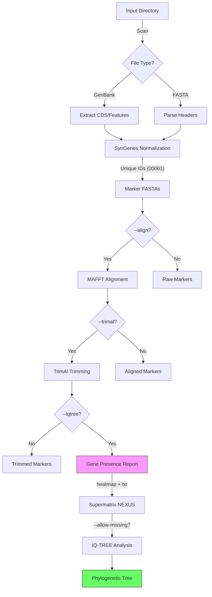

<p align="center">
  
</p>

<p align="center">
    <h1 align="center">SPLACE (<b>SP</b>Lit, <b>A</b>lign and <b>C</b>oncatenat<b>E</b>)</h1>
</p>

### Platform Compatibility

| Operating System | Status |
|:---|:---|
| Ubuntu |  |
| macOS |  |
| Windows |  |

# Contents Overview
- [System Overview](#system-overview)
- [Licence](#licence)
- [Getting Started](#getting-started)
  - [Prerequisites](#prerequisites)
  - [Installation](#installation)
  - [Usage](#usage)
    - [Parameter Overview](#parameter-overview)
  - [Example Command](#example-command)
  - [Tool Configuration](#tool-configuration)
  - [Remote Genome Retrieval](#remote-genome-retrieval)
  - [Taxonomy and FASTA Header Metadata](#taxonomy-and-fasta-header-metadata)
  - [Gene Presence Report](#gene-presence-report)
  - [Sequence Identifiers](#sequence-identifiers)
- [SPLACE Workflow](#splace-workflow)
- [Citing SPLACE](#citing-splace)
- [Contact](#contact)

***
&nbsp;
## System Overview
##### [:rocket: Go to Contents Overview](#contents-overview)
**SPLACE** is a comprehensive Python toolkit designated to automate phylogenomic analysis pipelines. It handles gene splitting, alignment, trimming, and concatenation, and now supports direct phylogenetic tree inference.

It integrates with **SynGenes** for gene name standardization, **MAFFT** for alignment, **TrimAl** for quality control, and **IQ-TREE** for phylogeny reconstruction, utilizing asynchronous I/O and parallel processing for high performance.

**Key Features:**
*   **Automatic Extraction:** Detects and extracts CDS from GenBank files or genes from FASTA headers suitable for SynGenes.
*   **Gene Normalization:** Ensures consistent gene naming across datasets.
*   **Alignment & Trimming:** Automated MSA and cleaning steps.
*   **Phylogeny:** Supermatrix generation to NEXUS format and ML tree inference with IQ-TREE.
*   **Benchmarking:** Metrics for pipeline performance analysis.

### Version Comparison

| Feature | SPLACE v2/v3 (Legacy) | SPLACE (New) |
| :--- | :--- | :--- |
| **Input Method** | Text file list | Automatic Directory Scan |
| **Execution** | Sequential | Asynchronous & Parallel |
| **Gene Normalization** | basic string split | **SynGenes** Integration |
| **Phylogeny** | Concatenation Only | **IQ-TREE** Integration |
| **Benchmarking** | Manual / Not Built-in | Native (`--benchmark`) |
| **Language/Deps** | Python <3.10 | Python 3.12+ (Asyncio) |

&nbsp;
> [!NOTE]
> This project is an enhanced version of the original SPLACE repository.
> See the original repository at [https://github.com/reinator/splace/](https://github.com/reinator/splace/)

&nbsp;
## Licence
##### [:rocket: Go to Contents Overview](#contents-overview)
**SPLACE** is released under the **GPL-3.0 License**.
&nbsp;

## Getting Started
##### [:rocket: Go to Contents Overview](#contents-overview)
### Prerequisites
Before you run **SPLACE**, make sure you have the following prerequisites installed on your system:
- **Python Environment and Package Manager**
    - Python **version 3.12 or higher**[^1]
    - conda[^1]
    - git[^1]
- **Required Software and Libraries**
    - `mafft`     # For multiple sequence alignment (REQUIRED for --align)
    - `trimal`    # For automated alignment trimming (REQUIRED for --trimal)
    - `iqtree`    # For phylogeny (REQUIRED for --iqtree)
    - `biopython` # For biological sequence handling and parsing
    - `requests`  # For GBIF HTTP queries
    - `syngenes`  # For gene nomenclature standardization
[^1]: These prerequisites are essential for running SPLACE effectively.

&nbsp;
## Installation
##### [:rocket: Go to Contents Overview](#contents-overview)
#### Conda (Recommended)

1. Clone the repository:
```shell
git clone https://github.com/luanrabelo/SPLACE.git
cd SPLACE  
```

2. Create and activate the environment:
```shell
conda env create -f environment.yml
conda activate splace
```

#### Pip
If you prefer not to use Conda:
```bash
pip install -e .
```

&nbsp;  
## Usage
#### Parameter Overview
##### [:rocket: Go to Contents Overview](#contents-overview)

The basic syntax is `python splace.py [options]`.

| Parameter | Function | Description |
|-----------|-----------|-------------|
| `-i`, `--input_dir` | Input | Path to a directory containing local **GenBank** or **FASTA** files. Optional when `--ncbi-search-term` is used. |
| `-o`, `--output_dir` | Output | Directory where results will be saved. |
| `--gb-type` | Extraction | Type of Genbank data: `mt` (mitochondrial) or `cp` (chloroplast). Default: `mt`. |
| `--gbif` | Taxonomy | Query GBIF for valid binomial species names (`Genus species`) found in GenBank records and store the recovered ranks in the run metadata table. |
| `--genes` | Filtering | Comma-separated gene names (e.g., `12S,16S,COI`) or path to a text file (one gene per line). Mutually exclusive with `--feature-types`. Default: built-in list per `--gb-type`. |
| `--feature-types` | Filtering | Comma-separated GenBank feature types to extract (e.g., `CDS,rRNA,tRNA`). Mutually exclusive with `--genes`. Default: `CDS`. |
| `--fasta-header-config` | FASTA Header | YAML file that defines the header template for FASTA records. Default: `fasta_header.yaml`. |
| `--ncbi-search-term` | Remote Retrieval | Taxonomic name or rank used by SPLACE to build the NCBI genome query automatically, for example `Bufonidae`, `Coffea`, or `Coffea arabica`. |
| `--apis-env` | Remote Retrieval | Optional path to an `apis.env` file containing `NCBI_API_KEY` and `NCBI_EMAIL`. Default: `apis.env`. |
| `--ncbi-download-dir` | Remote Retrieval | Directory where downloaded GenBank files will be stored. Required with `--ncbi-search-term`. |
| `--ncbi-complete` | Remote Retrieval | Include complete genomes in the automatically generated NCBI query. |
| `--ncbi-partial` | Remote Retrieval | Include partial or incomplete genomes in the automatically generated NCBI query. You may combine it with `--ncbi-complete`. |
| `--ncbi-refseq-only` | Remote Retrieval | Restrict the automatically generated NCBI query to RefSeq genomes only. |
| `--download-only` | Remote Retrieval | Run only the NCBI search/download stage and stop before FASTA extraction or downstream analyses. |
| `--align` | Alignment | Enable multiple sequence alignment using **MAFFT**. |
| `--trimal` | Trimming | Enable trimming using **TrimAl**. |
| `--iqtree` | Phylogeny | Enable phylogenetic inference using **IQ-TREE**. |
| `--allow-missing` | Phylogeny | Allow missing data in the supermatrix (fills with `?`). Without this flag, genes absent from any taxon are removed. |
| `--overwrite` | Output | Overwrite existing output directories if they already exist. Without this flag, SPLACE exits with an error when output directories are present. |
| `--benchmark` | Performance | Enable execution time benchmarking. |
| `-t`, `--threads` | Performance | Number of threads for parallel processing. Default: 4. |
| `--config` | Configuration | Path to a YAML file with custom parameters for MAFFT, TrimAl, and IQ-TREE. See [Tool Configuration](#tool-configuration). |

&nbsp;
#### Example Command
##### [:rocket: Go to Contents Overview](#contents-overview)
After installing **SPLACE** and activating the conda environment:

**Full Pipeline (Extract -> Align -> Trim -> Tree)**
```shell
python splace.py -i data/raw/ -o results/ --gb-type mt --gbif --align --trimal --iqtree --threads 8 --benchmark
```

**Extraction and Alignment Only**
```shell
python splace.py -i data/raw/ -o results_aln/ --gb-type mt --align --threads 4
```

**Download GenBank Files from NCBI and Then Process Them**
```shell
python splace.py \
  --ncbi-search-term Bufonidae \
  --ncbi-download-dir data/ncbi_bufonidae \
  --ncbi-complete \
  --apis-env apis.env \
  --ncbi-refseq-only \
  -o results_ncbi \
  --gbif
```

**Search and Download Only**
```shell
python splace.py \
  --ncbi-search-term Bufonidae \
  --ncbi-download-dir data/ncbi_bufonidae \
  --ncbi-complete \
  --ncbi-partial \
  --apis-env apis.env \
  --ncbi-refseq-only \
  --download-only
```

> [!NOTE]
> Choose either `--genes` or `--feature-types` for GenBank extraction filters.

> [!NOTE]
> The script automatically detects input file formats (.gb, .fasta, etc.) across all declared sources.
> `--iqtree` requires `--trimal` to be active.

&nbsp;
> [!CAUTION]
> For **Fasta files**, ensure that the sequence headers are formatted correctly to include gene names for proper processing by **SPLACE**.
> Example header format with SynGenes support:
> ```
> > lcl|PX070005.1_cds_XZP64796.1_3 [gene=COX1] ...
> ```
> Or simple formats where the gene name is clear.

&nbsp;
## Tool Configuration
##### [:rocket: Go to Contents Overview](#contents-overview)

You can customize the parameters of **MAFFT**, **TrimAl**, and **IQ-TREE** by providing a YAML configuration file via the `--config` flag. A default template is included in the repository as `tools_config.yaml`.

```shell
python splace.py -i data/raw/ -o results/ --gb-type mt --align --trimal --iqtree --config tools_config.yaml
```

#### Configuration File Format

```yaml
mafft:
  # Additional MAFFT parameters (e.g., "--auto", "--localpair --maxiterate 1000")
  params: "--auto"
  # Preserve original case of sequences (uppercase/lowercase)
  preserve_case: true
  # Maximum time (in seconds) allowed per alignment
  timeout: 3600

trimal:
  # TrimAl trimming strategy (e.g., "-automated1", "-gappyout", "-strict")
  params: "-automated1"
  # Maximum time (in seconds) allowed per trimming
  timeout: 3600

iqtree:
  # Number of ultrafast bootstrap replicates (-B)
  bootstrap: 1000
  # Substitution model (-m). Use "MFP" for automatic ModelFinder selection
  model: "MFP"
  # Any extra IQ-TREE arguments (e.g., "-alrt 1000" for SH-aLRT test)
  extra_args: ""
```

#### Parameter Reference

| Section | Parameter | Default | Description |
|:---|:---|:---|:---|
| `mafft` | `params` | `--auto` | MAFFT alignment strategy. See [MAFFT documentation](https://mafft.cbrc.jp/alignment/software/manual/manual.html). |
| `mafft` | `preserve_case` | `true` | Keep original sequence case (upper/lowercase). |
| `mafft` | `timeout` | `3600` | Max seconds per alignment job. |
| `trimal` | `params` | `-automated1` | TrimAl trimming method. Alternatives: `-gappyout`, `-strict`, `-gt 0.8`, etc. |
| `trimal` | `timeout` | `3600` | Max seconds per trimming job. |
| `iqtree` | `bootstrap` | `1000` | Ultrafast bootstrap replicates (`-B`). |
| `iqtree` | `model` | `MFP` | Substitution model (`-m`). `MFP` runs ModelFinder automatically. |
| `iqtree` | `extra_args` | *(empty)* | Additional IQ-TREE flags (e.g., `-alrt 1000 -abayes`). |

> [!NOTE]
> If `--config` is not provided, SPLACE uses the default values shown above. You only need to include the sections you want to override — missing sections will use their defaults.

&nbsp;
## Remote Genome Retrieval
##### [:rocket: Go to Contents Overview](#contents-overview)

SPLACE can download nucleotide genomes directly from **NCBI** before scanning and processing the input sources. The Python CLI now performs this stage with **Bio.Entrez** from **Biopython**, which keeps the retrieval logic aligned with the package-oriented future of the project.

SPLACE builds the Entrez query internally from the taxon given to `--ncbi-search-term`, the organelle selected by `--gb-type`, the genome scope flags `--ncbi-complete` and/or `--ncbi-partial`, and the optional `--ncbi-refseq-only` switch.

At least one of `--ncbi-complete` or `--ncbi-partial` must be selected. Both can be used together in the same run.

If an `apis.env` file is available and contains `NCBI_API_KEY`, SPLACE downloads at up to **10 requests per second**. Without that key, SPLACE limits itself to **2 requests per second**.

#### apis.env format

```dotenv
NCBI_API_KEY=your_ncbi_api_key
NCBI_EMAIL=your.email@example.org
```

#### Notes

- The user does not need to write the full Entrez query manually. SPLACE generates it from the provided taxonomic name/rank and genome scope flags.
- `--gb-type mt` builds a mitochondrial query, while `--gb-type cp` builds a chloroplast/plastid query.
- Downloaded records are saved as `.gbk` files in the folder provided to `--ncbi-download-dir`.
- Use `--download-only` when you want to stop after search and retrieval, without running FASTA extraction or any downstream analysis.
- After the retrieval-only stage, this is the recommended moment to add any outgroup files to the input/download folder before running extraction, alignment, trimming, or phylogeny.
- If both `--input_dir` and `--ncbi-search-term` are provided, SPLACE scans both sources in the same run.

#### Two-Step Workflow

1. Run the retrieval stage with `--ncbi-search-term`, `--ncbi-download-dir`, and at least one of `--ncbi-complete` or `--ncbi-partial`.
2. Add any outgroup GenBank or FASTA files that should participate in the analysis.
3. Re-run SPLACE with the usual extraction and analysis flags such as `--gbif`, `--align`, `--trimal`, and `--iqtree`.

Because SPLACE is expected to become a Conda-distributed toolkit that can be embedded in other pipelines, the retrieval logic is intentionally exposed in small reusable functions under the Python package as well.

&nbsp;
## Taxonomy and FASTA Header Metadata
##### [:rocket: Go to Contents Overview](#contents-overview)

When `--gbif` is enabled, SPLACE reads the organism name from each GenBank record and validates whether it follows the binomial pattern `Genus species`. Valid names are queried against the GBIF species API, and the recovered ranks are stored in the metadata output.

Invalid names are not queried. Instead, they are recorded in `logs/invalid_gbif_species.log` together with the source file and accession.

#### FASTA Header Configuration

SPLACE now reads the FASTA header structure from `fasta_header.yaml`. The default file created in the project root is:

```yaml
template: "{accession}_{family}_{genus}_{species}"
missing_value: "?"
```

Supported placeholders are:

| Placeholder | Description |
|:---|:---|
| `accession` | GenBank accession or record identifier |
| `authorship` | GBIF authorship, when available |
| `class` | GBIF class rank |
| `family` | GBIF family rank, or a lineage-derived family fallback when available |
| `file_name` | Source GenBank file name |
| `genus` | Genus parsed from the organism name |
| `kingdom` | GBIF kingdom rank |
| `order` | GBIF order rank |
| `organism` | Full organism name |
| `phylum` | GBIF phylum rank |
| `species` | Specific epithet parsed from the organism name |
| `uid` | Sequential five-digit per-record identifier |

If a placeholder has no value for a given record, SPLACE inserts `?` in the header and records the missing fields in `logs/fasta_header_missing_fields.log`, together with the source file, accession, and marker name.

#### Metadata Outputs

| File | Location | Description |
|:---|:---|:---|
| `genbank_metadata.tsv` | `metadata/` | One row per GenBank record with accession, organism, GBIF status, and retrieved taxonomy ranks. |
| `invalid_gbif_species.log` | `logs/` | Records whose organism names did not match the required `Genus species` pattern for GBIF lookup. |
| `fasta_header_missing_fields.log` | `logs/` | Marker-level log for sequences whose FASTA headers needed `?` placeholders. |

&nbsp;
## Gene Presence Report
##### [:rocket: Go to Contents Overview](#contents-overview)

When phylogenetic analysis is enabled (`--iqtree`), SPLACE automatically generates a **gene presence/absence report** before building the supermatrix. This report helps you identify which taxa are missing which genes — especially useful with `--allow-missing` or when working with chloroplast datasets that contain many genes.

#### Outputs

| File | Location | Description |
|:---|:---|:---|
| `gene_presence_report.txt` | Main output directory | ASCII table printed to console and saved as text. Shows `+` (present) / `-` (absent) per gene per taxon, with totals. |
| `gene_presence_heatmap.png` | Main output directory | Visual heatmap generated with seaborn. Rows are taxa (species in *italic* with accession number and unique ID), columns are genes. Green = present, red = absent. |

#### Example Heatmap

The heatmap provides a quick visual overview of data completeness across your dataset:
- **Rows**: taxa labeled as *Genus species* (Accession) [UID]
- **Columns**: gene names
- **Colors**: green (`Present`) / red (`Absent`)

The figure size adjusts dynamically based on the number of taxa and genes, ensuring readability even for large chloroplast datasets.

> [!TIP]
> Use the heatmap to decide whether `--allow-missing` is appropriate for your dataset. If most cells are green with only a few scattered red cells, allowing missing data is generally safe.

&nbsp;
## Sequence Identifiers
##### [:rocket: Go to Contents Overview](#contents-overview)

Each sequence extracted by SPLACE now receives its FASTA header from the template defined in `fasta_header.yaml`. This makes the Python workflow consistent with the desktop application's configurable header builder.

#### Default Header Format

```
>NC_008535.1_Rubiaceae_Coffea_arabica
```

| Component | Example | Description |
|:---|:---|:---|
| Accession | `NC_008535.1` | GenBank accession or source identifier. |
| Family | `Rubiaceae` | GBIF family rank, or `?` when unavailable. |
| Genus | `Coffea` | Genus parsed from the organism name. |
| Species | `arabica` | Specific epithet parsed from the organism name. |

#### Examples

```
>NC_008535.1_Rubiaceae_Coffea_arabica
>OP946451.1_?_Cinchona_officinalis
>PX000001.1_?_?_?
```

> [!NOTE]
> If you need a guaranteed per-record suffix, include `{uid}` in `fasta_header.yaml`. Missing placeholders are always replaced with `?` and logged for review.

&nbsp;
## SPLACE Workflow
##### [:rocket: Go to Contents Overview](#contents-overview)



## Citing **SPLACE**
##### [:rocket: Go to Contents Overview](#contents-overview)
When referencing the **SPLACE**, please cite:
```
Oliveira, R. R., Vasconcelos, S., & Oliveira, G. (2022). SPLACE: A tool to automatically SPLit, Align, and ConcatenatE genes for phylogenomic inference of several organisms. Frontiers in Bioinformatics, 2.
https://doi.org/10.3389/fbinf.2022.1074802
```
***  
## Contact
##### [:rocket: Go to Contents Overview](#contents-overview)
For reporting bugs or feedback, please reach out to **Luan Rabelo**: `luan.rabelo@pq.itv.org`
***  