<p align="center">
  
</p>

<p align="center">
    <h1 align="center">SPLACE (<b>SP</b>Lit, <b>A</b>lign and <b>C</b>oncatenat<b>E</b>)</h1>
</p>

### Platform Compatibility

## Platform Compatibility


<table width="100%">
  <thead>
    <tr>
      <th align="center" width="30%">Operating System</th>
      <th align="center" width="30%">Automated Tests</th>
      <th align="center" width="40%">Downloads</th>
    </tr>
  </thead>
  <tbody>
    <tr>
      <td align="left">
        
      </td>
      <td align="left">
        <a href="https://github.com/luanrabelo/splace/actions/workflows/test-ubuntu.yml"></a>
      </td>
      <td align="left">
        
      </td>
    </tr>
    <tr>
      <td align="left">
        
      </td>
      <td align="left">
        <a href="https://github.com/luanrabelo/splace/actions/workflows/test-macos.yml"></a>
      </td>
      <td align="left">
        
      </td>
    </tr>
    <tr>
      <td align="left">
        
      </td>
      <td align="left">
        <a href="https://github.com/luanrabelo/splace/actions/workflows/test-windows.yml">
          
        </a>
      </td>
      <td align="left">
        <a href="https://github.com/luanrabelo/splace/releases/latest"></a>
      </td>
    </tr>
  </tbody>
</table>

# Contents Overview
- [System Overview](#system-overview)
- [Licence](#licence)
- [SPLACE GUI](#splace-gui)
  - [Load Data](#load-data)
  - [Select Markers](#select-markers)
  - [Export FASTA](#export-fasta)
  - [Alignment - Desktop](#alignment---desktop)
  - [Concatenate and Generate NEXUS](#concatenate-and-generate-nexus)
  - [Phylogenetic Inference](#phylogenetic-inference)
- [Getting Started](#getting-started)
  - [Prerequisites](#prerequisites)
  - [Installation](#installation)
  - [Usage](#usage)
    - [Parameter Overview](#parameter-overview)
  - [Example Command](#example-command)
  - [Tool Configuration](#tool-configuration)
  - [Remote Genome Retrieval](#remote-genome-retrieval)
  - [Taxonomy and FASTA Header Metadata](#taxonomy-and-fasta-header-metadata)
  - [Gene Presence Report](#gene-presence-report)
  - [Sequence Identifiers](#sequence-identifiers)
- [SPLACE Workflow](#splace-workflow)
- [Citing SPLACE](#citing-splace)
- [Contact](#contact)

***
&nbsp;
## System Overview
##### [:rocket: Go to Contents Overview](#contents-overview)
**SPLACE** is a comprehensive Python toolkit designated to automate phylogenomic analysis pipelines. It handles gene splitting, alignment, trimming, and concatenation, and now supports direct phylogenetic tree inference.

It integrates with **SynGenes** for gene name standardization, **MAFFT** for alignment, **TrimAl** for quality control, and **IQ-TREE** for phylogeny reconstruction, utilizing asynchronous I/O and parallel processing for high performance.

**Key Features:**
*   **Automatic Extraction:** Detects and extracts CDS from GenBank files or genes from FASTA headers suitable for SynGenes.
*   **Gene Normalization:** Ensures consistent gene naming across datasets.
*   **Alignment & Trimming:** Automated MSA and cleaning steps.
*   **Phylogeny:** Supermatrix generation to NEXUS format and ML tree inference with IQ-TREE.
*   **Benchmarking:** Metrics for pipeline performance analysis.

### Version Comparison

| Feature | SPLACE v2/v3 (Legacy) | SPLACE (New) |
| :--- | :--- | :--- |
| **Input Method** | Text file list | Automatic Directory Scan |
| **Execution** | Sequential | Asynchronous & Parallel |
| **Gene Normalization** | basic string split | **SynGenes** Integration |
| **Phylogeny** | Concatenation Only | **IQ-TREE** Integration |
| **Benchmarking** | Manual / Not Built-in | Native (`--benchmark`) |
| **Language/Deps** | Python <3.10 | Python 3.12+ (Asyncio) |

&nbsp;
> [!NOTE]
> This project is an enhanced version of the original SPLACE repository.
> See the original repository at [https://github.com/reinator/splace/](https://github.com/reinator/splace/)

&nbsp;
## Licence
##### [:rocket: Go to Contents Overview](#contents-overview)
**SPLACE** is released under the **GPL-3.0 License**.
&nbsp;

## SPLACE GUI
##### [:rocket: Go to Contents Overview](#contents-overview)

The **SPLACE GUI** provides a user friendly graphical interface for the SPLACE toolkit. It allows users to import organellar genomes, inspect their annotations, select molecular markers and perform phylogenomic analyses without manually writing command line instructions.

SPLACE can be used in two different modes:

1. **SPLACE Web**, which allows users to import GenBank records, inspect available markers and export individual FASTA files.
2. **SPLACE Desktop**, which provides the complete workflow, including sequence alignment with MAFFT, alignment trimming with trimAl, matrix concatenation, NEXUS generation and phylogenetic inference with IQ-TREE3.

<details open>
<summary>First Step - Download and Welcome Screen</summary>

1. Download the latest **SPLACE Desktop** installer for your operating system from the [Releases page](https://github.com/luanrabelo/splace/releases/latest).
2. Run the installer or open the executable provided for your operating system.
3. Wait while SPLACE initializes the interface and verifies the programs required by the Desktop workflow.
4. When necessary, SPLACE will report missing dependencies and provide instructions for installing or configuring them.
The main external programs used by the Desktop workflow include:
  - **MAFFT**, for multiple sequence alignment.
  - **trimAl**, for removing poorly aligned positions.
  - **IQ-TREE3**, for maximum likelihood phylogenetic inference.
  - **seqkit**, for translation and sequence processing in amino acid and Codon-aware workflows.
  - Python and **ClipKIT** are optional and are required only when ClipKIT is selected as the trimming backend for a Codon-aware analysis.

After the initial verification, select the interface language and click **Start SPLACE**.


> [!NOTE]
> Click in the buttons below to view steps for installing and running the SPLACE GUI on your operating system.

</details>

<details>
<summary>Second Step - Interface Overview</summary>

The SPLACE interface is organized into four main areas.
### Top Bar

The top bar provides quick access to the main application controls.

  - a. **Pipeline navigator**, represented by the menu icon, shows or hides the left navigation panel.
  - b. **Language selector** changes the interface between English, Portuguese and Spanish.
  - c. **NCBI API key** opens the API key configuration window.
  - d. **Display settings** control the theme, interface density and text size.
  - e. **Activity log** shows or hides the execution log panel.
  - f. **Help** opens the welcome screen again.
  - g. **GitHub** opens the SPLACE repository.

The selected language, theme, density and font size are retained by the application.

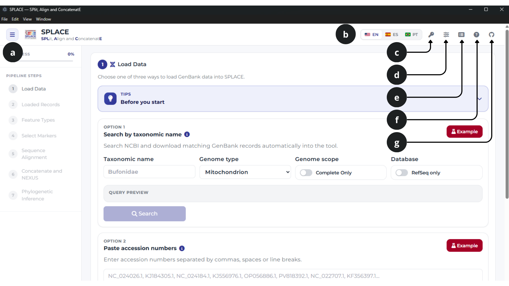

### Pipeline Navigator
The panel on the left displays the seven steps of the SPLACE workflow.
The progress indicator is updated automatically as the analysis advances. Completed steps receive a confirmation symbol, while unavailable steps remain locked until the required previous steps have been completed.
Clicking an available step scrolls the workspace directly to the corresponding section.


### Main Workspace

The central area contains the controls for each stage of the analysis. Sections are progressively displayed as data are imported and the required selections are completed.

### Activity Log

The activity log records searches, downloads, taxonomy queries, sequence processing, alignment, trimming and phylogenetic inference.
The buttons at the top of the log panel allow you to:

1. Copy the complete log.
2. Download the log as a text file.
3. Clear the current log.
4. Hide the log panel.

The log is especially useful for identifying invalid records, skipped sequences, missing annotations or errors reported by external programs.

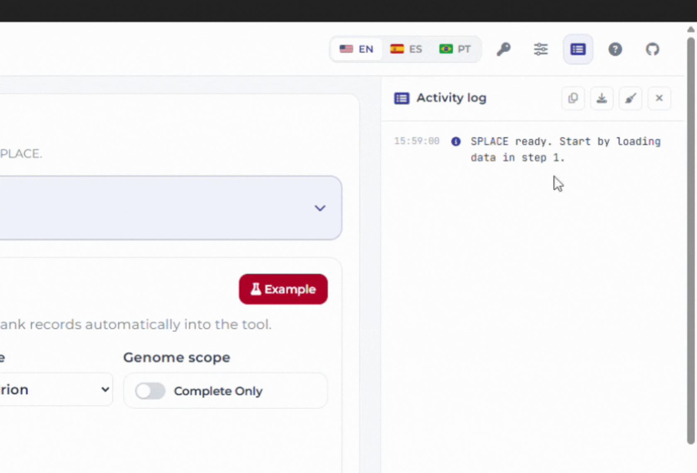

</details>

<details>
<summary>Load Data</summary>

## Step 1: Load Data

The first step imports GenBank records into SPLACE. Three complementary import methods are available, and records imported using different methods can be combined in the same dataset.

### Option 1: Search by Taxonomic Name

Use this option when you want SPLACE to search NCBI for genomes belonging to a taxonomic group.
Enter a taxonomic name such as a species, genus, family or another supported taxonomic rank. Then configure the search using the following fields:

1. **Taxonomic name**, the scientific or higher taxonomic name used in the NCBI query.
2. **Genome type**, either mitochondrial or chloroplast.
3. **Complete Only**, restricts the search to records identified as complete genomes.
4. **RefSeq only**, restricts the search to curated RefSeq records.

The **Query preview** displays the NCBI query that will be submitted.
The **Example** button automatically fills the fields with a demonstration search, allowing new users to understand how the query is constructed.
After clicking **Search**, SPLACE retrieves the matching accessions and opens a review window before downloading the complete GenBank records.


### Reviewing Search Results

The genome review window allows you to inspect the records returned by NCBI before importing them.

All records are enabled initially. The available controls allow you to:

1. Enable all records.
2. Disable all records.
3. Disable records containing `UNVERIFIED` in their NCBI title.
4. Select only complete genomes.
5. Select only partial genomes.

The table displays the accession number, genome description and title based classification of each result.

Review the selected records and click **Import selected genomes** to continue.

> Records marked as `UNVERIFIED` should be inspected carefully before inclusion in phylogenetic analyses.


### Option 2: Paste Accession Numbers

Use this option when the NCBI accession numbers are already known.
Accession numbers can be separated by:

1. Commas.
2. Spaces.
3. Line breaks.

For example:

```text
NC_061537
NC_023122
NC_042724
```

Click **Fetch** to download the corresponding GenBank records.
The **Example** button inserts a demonstration accession list that can be used to test the workflow.

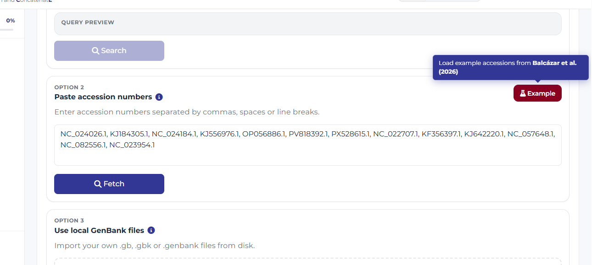

### Option 3: Use Local GenBank Files

Use this option when the GenBank records are already stored on your computer.
SPLACE accepts the following extensions:

```text
.gb
.gbk
.genbank
```

Files or folders can be dragged directly into the import area. You may also click the area to browse your computer.
When a folder is selected, SPLACE searches it for compatible GenBank files and imports the valid records.
Local records and records downloaded from NCBI may be combined in the same analysis.


### Using an NCBI API Key

An NCBI API key is not required, but it can make large imports faster.
Without an API key, SPLACE performs approximately three NCBI requests per second. With a saved valid API key, it can use up to ten requests per second.

To configure the key:

1. Click the key icon in the top bar.
2. Paste your NCBI API key.
3. Click **Save key**.

The saved key is used by both the taxonomic search and accession import options.
The progress window displays whether the API key is active and shows the request rate used during the import.


</details>

<details>
<summary>Select Markers</summary>

## Step 2: Loaded Records

After importing at least one GenBank record, SPLACE displays the **Loaded Records** table.
This step should be used to verify species names, inspect the number of annotated markers and retrieve taxonomic information.

### Records Table

Each row represents one imported genome. Depending on the visible columns, the table can display:

1. Accession.
2. Kingdom.
3. Phylum.
4. Class.
5. Order.
6. Family.
7. Genus.
8. Species.
9. Authorship.
10. Number of protein coding genes.
11. Number of rRNA genes.
12. Number of tRNA genes.
13. Record source, either NCBI or a local file.

Use the column buttons above the table to show or hide individual fields.
The search field can be used to filter records by accession, species, family or other displayed information.

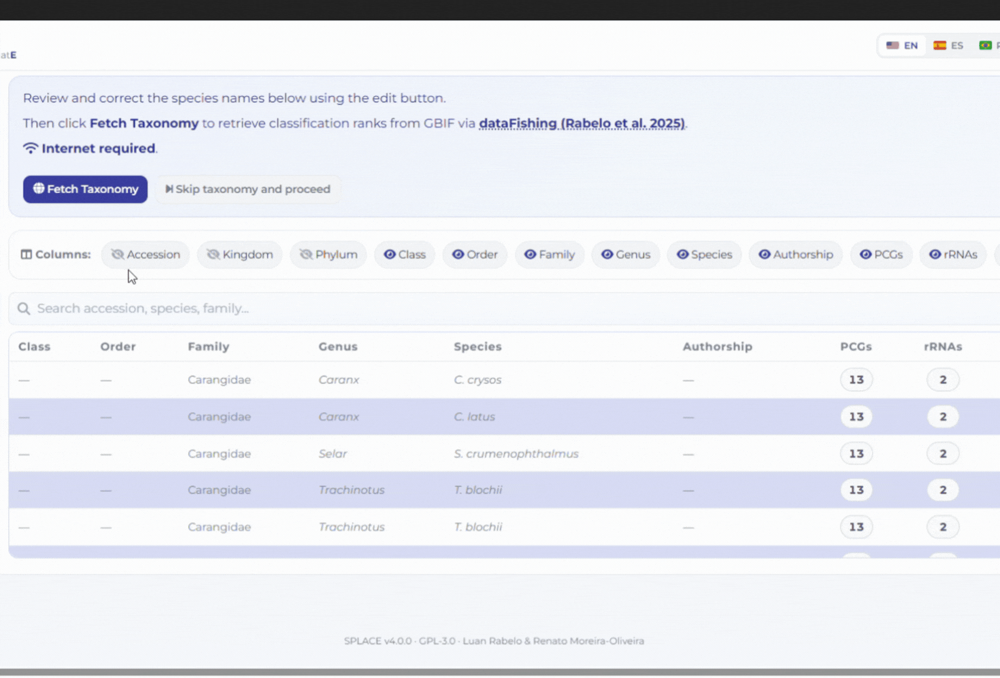

### Editing a Record

Click the edit button associated with a record to open the record editor.
The editor allows you to modify:

1. Genus.
2. Species.
3. Kingdom.
4. Phylum.
5. Class.
6. Order.
7. Family.

You can also retrieve the taxonomy of an individual record directly from GBIF by clicking **Fetch Taxonomy from GBIF**.

Species names should be reviewed before continuing. Incorrect names, special characters and duplicated identifiers may cause problems when FASTA headers and concatenated matrices are generated.

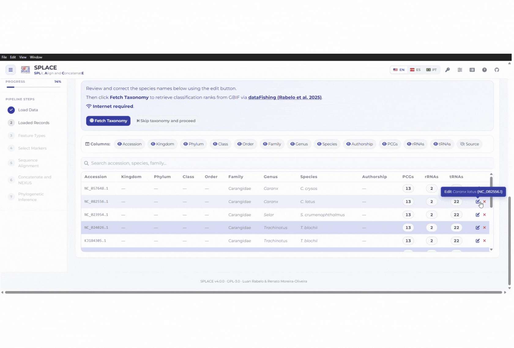

### Fetching Taxonomy

Click **Fetch Taxonomy** to retrieve classification ranks from GBIF through **dataFishing (Rabelo et al. 2025)**.
SPLACE groups repeated species names into unique queries, retrieves the corresponding taxonomy and updates the records as matches are confirmed.
The progress window displays:

1. The current species.
2. The number of completed queries.
3. Successful matches.
4. Failed queries.

After taxonomy retrieval, SPLACE also displays a hierarchical taxonomic tree summarizing the imported records.

Taxonomy retrieval requires an internet connection.


### Skipping Taxonomy

Taxonomy retrieval can be skipped by clicking **Skip taxonomy and proceed**.
A confirmation window will explain that invalid species names, special characters or duplicated entries may produce errors in later analyses.
Skipping taxonomy does not prevent marker extraction, but reviewing the species names is strongly recommended.

### Removing or Clearing Records

Individual genomes can be removed using the remove button in their table row.
The **Clear all** button removes every loaded record and resets the current workflow.
These operations require confirmation because they cannot be undone.

</details>

<details>
<summary>Select Markers</summary>

## Step 3: Feature Types

SPLACE extracts annotated features from the imported GenBank records and groups them into the following categories:

1. **CDS**, protein coding sequences.
2. **rRNA**, ribosomal RNA genes.
3. **tRNA**, transfer RNA genes.

Activate the categories that should be included in the marker selection step.
For example, a mitochondrial phylogeny based only on protein coding genes can be configured by activating **CDS** and disabling the other categories.
Gene names are standardized using **SynGenes (Rabelo et al., 2024)**, reducing differences caused by alternative names, abbreviations and annotation conventions.

### Unknown Gene Names

When a gene name cannot be standardized automatically, SPLACE opens the **Gene Names Not Found in SynGenes** window.
For each unrecognized annotation, the window displays:

1. Species.
2. File or accession.
3. Original gene name.
4. Standardized name selector.

Select the appropriate standardized name or choose **skip** to exclude that annotation from the analysis.

Use **Apply Corrections** to save the selected names or **Skip All** to exclude all unresolved annotations.

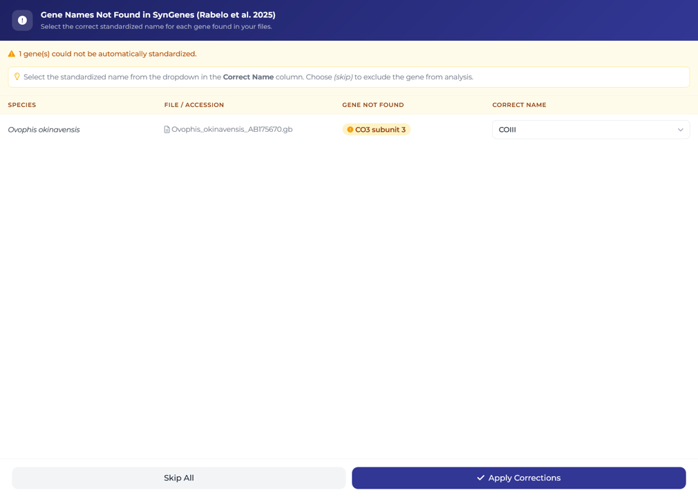

## Step 4: Select Markers

The **Select Markers** section displays all markers found within the active feature categories.
Each marker card shows the marker name and the number of genomes in which it was detected.
Click a marker to select or deselect it.
The number of currently selected markers is displayed beside the section title.

### Selection Shortcuts

The following buttons simplify marker selection:

1. **Select All**, selects every visible marker.
2. **None**, clears the complete marker selection.
3. **Shared Only**, selects markers present in every imported genome.
4. **Default to Phylogeny**, selects the recommended marker set according to the detected genome type.

For mitochondrial datasets, the default selection includes the commonly used mitochondrial protein coding genes.
For chloroplast datasets, the default selection includes a predefined set of frequently used plastid markers.

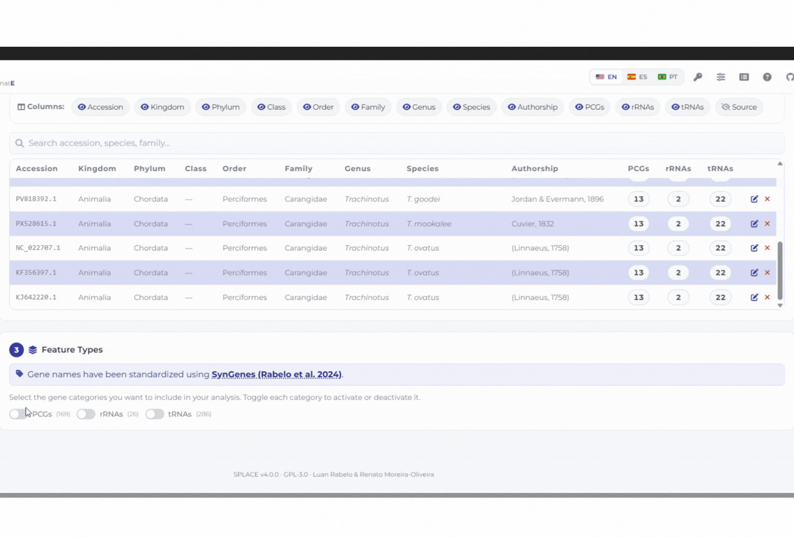

### Missing Markers

When a selected marker is absent from one or more records, SPLACE displays a **Missing Genes** warning.
The warning identifies the affected marker and the genomes in which it was not detected.
This information should be reviewed before concatenation, especially when a complete matrix without missing loci is required.

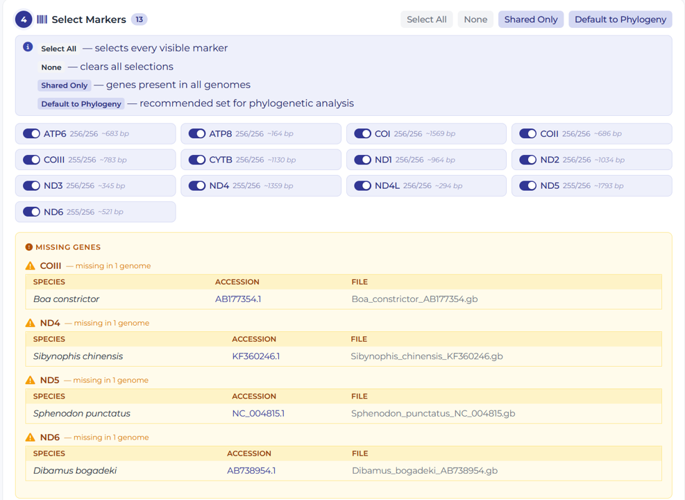

### Duplicated Markers

Some genomes may contain more than one annotation for the same protein coding or rRNA gene.
When duplicates are detected, SPLACE displays:

1. Species or accession.
2. Number and length of the available copies.
3. Mean marker length in the other genomes.
4. The copy that will be used.

Only one copy is used for each genome. By default, the longest copy is selected, but the user can choose another copy when appropriate.

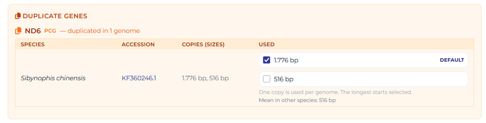

### Gene Presence Heatmap

The **Gene Presence Heatmap** summarizes the distribution of markers among the imported genomes.
Rows represent genomes or species, while columns represent markers.
The heatmap uses contrasting colors to distinguish present and absent markers. It can be used to identify:

1. Markers shared by all genomes.
2. Records with incomplete annotations.
3. Genes that occur only in part of the dataset.
4. Potential outliers or problematic genome records.

### Marker Length Heatmap

The Desktop version also displays a **Marker Length Heatmap** for the selected markers.
Each marker is scaled independently using its minimum and maximum length. This makes it easier to identify unusually short or long sequences within each locus.

Because each column uses its own scale, colors should be compared within a marker, not between different markers.


</details>

<details>
<summary>Export FASTA</summary>

## Step 5 in SPLACE Web: Export FASTA Files

In the Web version, the workflow ends with the export of unaligned FASTA files.
Click **Download FASTA Files** to open the FASTA Header Builder.
The Web version creates one FASTA file for each selected marker. These files can then be used in external alignment and phylogenetic programs.
For alignment, trimming, concatenation and tree inference within SPLACE, use the Desktop version.

## FASTA Header Builder

The FASTA Header Builder defines the sequence identifiers used in exported and aligned FASTA files.
Available fields may include accession, taxonomy ranks and species information.

To construct a header:

1. Click an available field to add it to the header.
2. Click a selected field to remove it.
3. Drag selected fields to change their order.
4. Choose a separator, such as underscore, pipe or dash.
5. Inspect the generated preview.

For example, a header composed of accession, family, genus, and species may be displayed as:

```text
>NC_024166_Anura_Rhinella_Rhinella_marina
```


SPLACE checks whether the selected fields produce duplicated headers. When duplicates are detected, add another identifying field, such as the accession number.


In the Web version, FASTA files can be downloaded as:

1. A single ZIP archive.
2. Individual FASTA files.

In the Desktop version, confirming the header unlocks the sequence alignment controls.

</details>

<details>
<summary>Alignment - Desktop</summary>

## Step 5 in SPLACE Desktop: Sequence Alignment

The Desktop workflow continues from marker selection to sequence alignment.
Step 5 is divided into header configuration, sequence type selection, MAFFT configuration, execution and optional trimming.

### Step 5a: Configure the FASTA Header

Open the FASTA Header Builder and define a unique identifier for every sequence.
The header must be confirmed before the remaining alignment settings are unlocked.
A preview of the selected format is displayed directly in the workspace after confirmation.

### Step 5b: Choose the Sequence Type

SPLACE supports three alignment strategies.

#### Nucleotide

The nucleotide option aligns the original DNA or RNA sequences directly with MAFFT.
This mode is recommended for:

1. rRNA genes.
2. tRNA genes.
3. Noncoding regions.
4. Closely related coding sequences.
5. Exploratory datasets.

#### Amino Acid

The amino acid option translates nucleotide sequences before alignment.
The translated proteins are aligned using MAFFT in amino acid mode.
This option is useful when protein coding genes are divergent and synonymous nucleotide substitutions make direct nucleotide alignment difficult.
The selected NCBI genetic code is used during translation.

#### Codon-aware

The Codon-aware option generates a protein guided DNA alignment while preserving complete codons.
This mode processes only annotated CDS features. rRNAs, tRNAs and other non CDS markers are skipped.
For each CDS marker, SPLACE performs the following operations:

1. Extracts the annotated CDS.
2. Applies the `codon_start` offset when present.
3. Validates whether the sequence is compatible with a complete reading frame.
4. Removes recognized terminal stop codons or incomplete terminal stop fragments when appropriate.
5. Translates the nucleotide sequence using the selected genetic code.
6. Aligns the protein sequences using MAFFT in amino acid mode.
7. Back translates the protein alignment to DNA.
8. Validates the resulting codon-preserving alignment.

The resulting DNA alignment contains gaps inserted in complete codon blocks.


### Codon-aware Policies

The following optional policies are available:

1. **Allow `/pseudo` and `/pseudogene` CDS**, retains annotations marked as pseudogenes.
2. **Allow internal stop codons**, retains sequences containing internal stop codons and reports warnings.
3. **Continue when amino acid and codon checks report warnings**, allows the workflow to finish when validation differences are detected, while retaining the warnings in the logs and pipeline metadata.

These options are disabled by default to prevent potentially invalid CDS sequences from being included without explicit user confirmation.

### Genetic Code

Select the NCBI genetic code that corresponds to the analyzed organisms and genome type.

Examples include:

1. Standard code, NCBI table 1.
2. Vertebrate mitochondrial code, NCBI table 2.
3. Invertebrate mitochondrial code, NCBI table 5.
4. Bacterial, archaeal and plant plastid code, NCBI table 11.

Selecting an incorrect genetic code may introduce false internal stop codons or incorrect protein translations.

### MAFFT Settings

The **MAFFT Settings** panel provides commonly used alignment strategies.

Available methods include:

1. `--auto`, automatically selects an appropriate strategy and is recommended for most analyses.
2. `--localpair`, uses L-INS-i and provides high accuracy for sequences with local similarities, but is slower.
3. `--globalpair`, uses G-INS-i and is suitable for globally alignable sequences.
4. `--genafpair`, uses E-INS-i and is useful for sequences containing long unalignable regions.
5. `--retree 2`, uses FFT-NS-2 for faster analyses.
6. `--retree 1`, uses FFT-NS-1 and is the fastest available option.

Additional controls include:

1. Maximum number of refinement iterations.
2. Number of threads used by each alignment job.
3. Gap opening penalty.
4. Gap extension penalty.
5. Automatic reverse complement detection.
6. Sequence reordering by similarity.
7. Preservation of uppercase and lowercase characters.
8. Additional MAFFT command line parameters.

SPLACE uses the number of available logical processors to estimate how many marker alignments can run simultaneously.

### Running the Alignment

Click **Run MAFFT Alignment** to align all selected markers.

A progress window displays the marker queue and the current processing phase.
For Codon-aware analyses, additional phases are displayed, including:

1. CDS extraction and validation.
2. Protein alignment.
3. Reading of aligned sequences.
4. Back translation to codon-preserving DNA.

Output files are saved automatically inside a dated SPLACE directory in the user's Documents folder.

### Alignment Results

After MAFFT finishes, the **Alignment Results** section provides an interactive summary for each marker.

Depending on the selected workflow, the following datasets may be available:

1. Raw sequences.
2. MAFFT aligned sequences.
3. Trimmed sequences.

The viewer reports sequence length, alignment gaps and summary statistics.
For nucleotide and Codon-aware alignments, sequences can also be translated inside the results viewer. This helps identify:

1. Possible internal stop codons.
2. Frame disruptions.
3. Unexpected sequence lengths.
4. Problematic individual records.

The alignment viewer also provides zoom, consensus and conservation information.

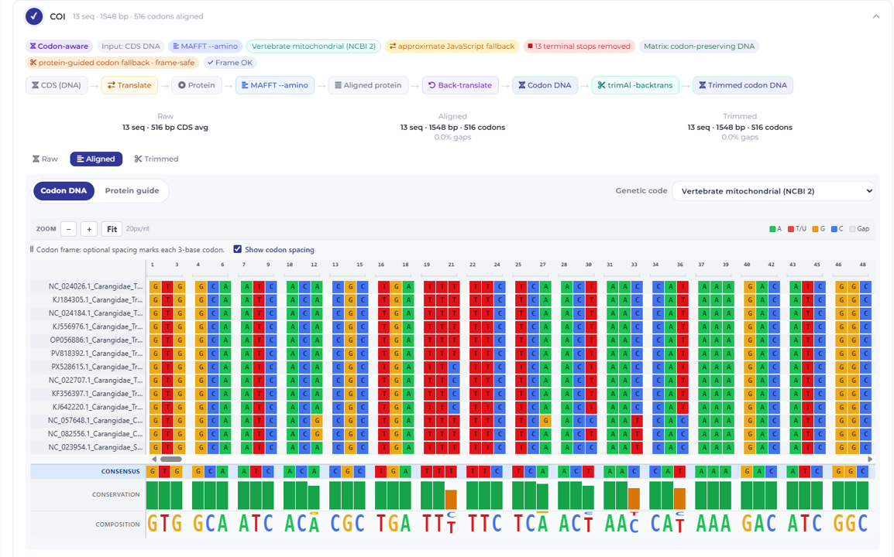

### Sequence Trimming

After alignment, SPLACE asks whether poorly aligned positions should be removed.
Click **No, skip trimming** to retain the original MAFFT alignments.
Click **Yes, run trimAl** to open the trimming settings.

Available trimAl modes include:

1. `-automated1`, an automatic heuristic method recommended for general use.
2. `-strict`, strict automated trimming.
3. `-strictplus`, an extended strict strategy.
4. `-gappyout`, removes columns with excessive gaps.
5. `-nogaps`, removes every column containing gaps.
6. `-noallgaps`, removes only columns composed entirely of gaps.
7. **Manual thresholds**, allows direct configuration of gap, similarity, consistency and window parameters.

Additional trimAl arguments can be entered in the corresponding field.

### Codon-aware Trimming

In a Codon-aware analysis, trimming is performed using the protein alignment and the result is converted back to codon preserving DNA.
The available backends are:

1. **Auto**, attempts trimAl and can use ClipKIT when needed.
2. **trimAl**, trims the protein alignment and guides DNA back translation.
3. **ClipKIT**, uses a Python based protein alignment trimming workflow.

ClipKIT is optional. When it is selected, SPLACE verifies whether Python and the `clipkit` package are available.
Codon trimming should be performed before concatenation. Removing individual codon positions is a separate operation performed during matrix generation.

</details>

<details>
<summary>Concatenate and Generate NEXUS</summary>

## Step 6: Concatenate and Generate NEXUS

After the alignment stage, SPLACE can concatenate the selected loci into a supermatrix.

### Alignment Source

Select which sequences should be concatenated:

1. **Trimmed sequences**, uses the trimAl or Codon-aware trimming output and is recommended when trimming was performed.
2. **Aligned sequences**, uses the original MAFFT output without trimming.

### Missing Sequences

By default, species missing any selected marker are excluded from the concatenated matrix.
Enable **Allow missing sequences** to retain those species. Missing loci will be filled with `?` characters using the corresponding partition length.

### Replacing Gaps with Missing Data

Enable **Replace alignment gaps with `?`** when the downstream program should interpret alignment gaps as missing data.
This replacement is applied to the exported concatenated FASTA and NEXUS matrices without changing partition coordinates.

### Selecting Outgroups

Use the outgroup search field to locate and select one or more species that should be used for rooting the phylogenetic tree.
The selected outgroups are transferred automatically to the IQ-TREE3 configuration in Step 7.

### Codon Position Partitions

For Codon-aware matrices, SPLACE can create separate character sets for the first, second and third codon positions of each gene.
Enable **Partition by codon position** to generate these additional partitions.

### Excluding Codon Positions

SPLACE can also generate an alternative matrix with selected codon positions removed.

You may remove:

1. First codon positions.
2. Second codon positions.
3. Third codon positions.

At least one codon position must remain in the resulting matrix.
The original Codon-aware alignment is preserved, allowing matrices with and without codon position filtering to be compared.

### Generating the Matrix

Click **Generate NEXUS & Partition Table**.
SPLACE validates the selected sequences, constructs the concatenated matrix and displays the resulting partition coordinates.
The generated files can be saved using:

1. **Save NEXUS**.
2. **Save partition table**.


</details>

<details>
<summary>Phylogenetic Inference</summary>

## Step 7: Phylogenetic Inference

The final step estimates a maximum likelihood phylogeny from the concatenated supermatrix using IQ-TREE3.

### Substitution Model

Select one of the available model options:

1. **ModelFinder**, automatically identifies the best fitting substitution model and is recommended for most analyses.
2. **MFP+MERGE**, searches for models while evaluating partition merging.
3. A predefined model, such as `GTR+G`, `GTR+G+I` or `HKY+G`.
4. A custom IQ-TREE model.

### Bootstrap Support

Available support options include:

1. UFBoot2 with 1,000 replicates.
2. UFBoot2 with 5,000 replicates.
3. Classical bootstrap with 100 replicates.
4. No bootstrap analysis.

UFBoot2 with 1,000 replicates is the default recommended option.

### Threads and Additional Parameters

Set the number of threads assigned to IQ-TREE3.
Additional IQ-TREE3 flags can be entered in the **Extra flags** field. The default configuration includes approximate likelihood ratio support and bootstrap tree optimization.

### Per Gene Trees

Enable **Also infer per-gene trees** to run a separate IQ-TREE3 analysis for each selected marker.
These analyses are stored in the `gene_trees` output directory.

### Command Preview

The complete IQ-TREE3 command is updated automatically as the settings change.
Use the copy button to copy the command for reproducibility, reporting or manual execution.

### Running IQ-TREE3

Click **Run IQ-TREE3** to begin the analysis.
The execution window displays the IQ-TREE3 log. Processing time depends on the matrix size, number of partitions, selected model search and number of bootstrap replicates.
After completion, SPLACE displays the output directory and the files generated by IQ-TREE3.
Click **Save Results as ZIP** to package the complete results.

</details>

## Getting Started
##### [:rocket: Go to Contents Overview](#contents-overview)
### Prerequisites
Before you run **SPLACE**, make sure you have the following prerequisites installed on your system:
- **Python Environment and Package Manager**
    - Python **version 3.12 or higher**[^1]
    - conda[^1]
    - git[^1]
- **Required Software and Libraries**
    - `mafft`     # For multiple sequence alignment (REQUIRED for --align)
    - `trimal`    # For automated alignment trimming (REQUIRED for --trimal)
    - `iqtree`    # For phylogeny (REQUIRED for --iqtree)
    - `biopython` # For biological sequence handling and parsing
    - `requests`  # For GBIF HTTP queries
    - `syngenes`  # For gene nomenclature standardization
[^1]: These prerequisites are essential for running SPLACE effectively.

&nbsp;
## Installation
##### [:rocket: Go to Contents Overview](#contents-overview)
#### Conda (Recommended)

1. Clone the repository:
```shell
git clone https://github.com/luanrabelo/SPLACE.git
cd SPLACE  
```

2. Create and activate the environment:
```shell
conda env create -f environment.yml
conda activate splace
```

#### Pip
If you prefer not to use Conda:
```bash
pip install -e .
```

&nbsp;  
## Usage
#### Parameter Overview
##### [:rocket: Go to Contents Overview](#contents-overview)

The basic syntax is `python splace.py [options]`.

| Parameter | Function | Description |
|-----------|-----------|-------------|
| `-i`, `--input_dir` | Input | Path to a directory containing local **GenBank** or **FASTA** files. Optional when `--ncbi-search-term` is used. |
| `-o`, `--output_dir` | Output | Directory where results will be saved. |
| `--gb-type` | Extraction | Type of Genbank data: `mt` (mitochondrial) or `cp` (chloroplast). Default: `mt`. |
| `--gbif` | Taxonomy | Query GBIF for valid binomial species names (`Genus species`) found in GenBank records and store the recovered ranks in the run metadata table. |
| `--genes` | Filtering | Comma-separated gene names (e.g., `12S,16S,COI`) or path to a text file (one gene per line). Mutually exclusive with `--feature-types`. Default: built-in list per `--gb-type`. |
| `--feature-types` | Filtering | Comma-separated GenBank feature types to extract (e.g., `CDS,rRNA,tRNA`). Mutually exclusive with `--genes`. Default: `CDS`. |
| `--fasta-header-config` | FASTA Header | YAML file that defines the header template for FASTA records. Default: `fasta_header.yaml`. |
| `--ncbi-search-term` | Remote Retrieval | Taxonomic name or rank used by SPLACE to build the NCBI genome query automatically, for example `Bufonidae`, `Coffea`, or `Coffea arabica`. |
| `--apis-env` | Remote Retrieval | Optional path to an `apis.env` file containing `NCBI_API_KEY` and `NCBI_EMAIL`. Default: `apis.env`. |
| `--ncbi-download-dir` | Remote Retrieval | Directory where downloaded GenBank files will be stored. Required with `--ncbi-search-term`. |
| `--ncbi-complete` | Remote Retrieval | Include complete genomes in the automatically generated NCBI query. |
| `--ncbi-partial` | Remote Retrieval | Include partial or incomplete genomes in the automatically generated NCBI query. You may combine it with `--ncbi-complete`. |
| `--ncbi-refseq-only` | Remote Retrieval | Restrict the automatically generated NCBI query to RefSeq genomes only. |
| `--download-only` | Remote Retrieval | Run only the NCBI search/download stage and stop before FASTA extraction or downstream analyses. |
| `--align` | Alignment | Enable multiple sequence alignment using **MAFFT**. |
| `--trimal` | Trimming | Enable trimming using **TrimAl**. |
| `--iqtree` | Phylogeny | Enable phylogenetic inference using **IQ-TREE**. |
| `--allow-missing` | Phylogeny | Allow missing data in the supermatrix (fills with `?`). Without this flag, genes absent from any taxon are removed. |
| `--overwrite` | Output | Overwrite existing output directories if they already exist. Without this flag, SPLACE exits with an error when output directories are present. |
| `--benchmark` | Performance | Enable execution time benchmarking. |
| `-t`, `--threads` | Performance | Number of threads for parallel processing. Default: 4. |
| `--config` | Configuration | Path to a YAML file with custom parameters for MAFFT, TrimAl, and IQ-TREE. See [Tool Configuration](#tool-configuration). |

&nbsp;
#### Example Command
##### [:rocket: Go to Contents Overview](#contents-overview)
After installing **SPLACE** and activating the conda environment:

**Full Pipeline (Extract -> Align -> Trim -> Tree)**
```shell
python splace.py -i data/raw/ -o results/ --gb-type mt --gbif --align --trimal --iqtree --threads 8 --benchmark
```

**Extraction and Alignment Only**
```shell
python splace.py -i data/raw/ -o results_aln/ --gb-type mt --align --threads 4
```

**Download GenBank Files from NCBI and Then Process Them**
```shell
python splace.py \
  --ncbi-search-term Bufonidae \
  --ncbi-download-dir data/ncbi_bufonidae \
  --ncbi-complete \
  --apis-env apis.env \
  --ncbi-refseq-only \
  -o results_ncbi \
  --gbif
```

**Search and Download Only**
```shell
python splace.py \
  --ncbi-search-term Bufonidae \
  --ncbi-download-dir data/ncbi_bufonidae \
  --ncbi-complete \
  --ncbi-partial \
  --apis-env apis.env \
  --ncbi-refseq-only \
  --download-only
```

> [!NOTE]
> Choose either `--genes` or `--feature-types` for GenBank extraction filters.

> [!NOTE]
> The script automatically detects input file formats (.gb, .fasta, etc.) across all declared sources.
> `--iqtree` requires `--trimal` to be active.

&nbsp;
> [!CAUTION]
> For **Fasta files**, ensure that the sequence headers are formatted correctly to include gene names for proper processing by **SPLACE**.
> Example header format with SynGenes support:
> ```
> > lcl|PX070005.1_cds_XZP64796.1_3 [gene=COX1] ...
> ```
> Or simple formats where the gene name is clear.

&nbsp;
## Tool Configuration
##### [:rocket: Go to Contents Overview](#contents-overview)

You can customize the parameters of **MAFFT**, **TrimAl**, and **IQ-TREE** by providing a YAML configuration file via the `--config` flag. A default template is included in the repository as `tools_config.yaml`.

```shell
python splace.py -i data/raw/ -o results/ --gb-type mt --align --trimal --iqtree --config tools_config.yaml
```

#### Configuration File Format

```yaml
mafft:
  # Additional MAFFT parameters (e.g., "--auto", "--localpair --maxiterate 1000")
  params: "--auto"
  # Preserve original case of sequences (uppercase/lowercase)
  preserve_case: true
  # Maximum time (in seconds) allowed per alignment
  timeout: 3600

trimal:
  # TrimAl trimming strategy (e.g., "-automated1", "-gappyout", "-strict")
  params: "-automated1"
  # Maximum time (in seconds) allowed per trimming
  timeout: 3600

iqtree:
  # Number of ultrafast bootstrap replicates (-B)
  bootstrap: 1000
  # Substitution model (-m). Use "MFP" for automatic ModelFinder selection
  model: "MFP"
  # Any extra IQ-TREE arguments (e.g., "-alrt 1000" for SH-aLRT test)
  extra_args: ""
```

#### Parameter Reference

| Section | Parameter | Default | Description |
|:---|:---|:---|:---|
| `mafft` | `params` | `--auto` | MAFFT alignment strategy. See [MAFFT documentation](https://mafft.cbrc.jp/alignment/software/manual/manual.html). |
| `mafft` | `preserve_case` | `true` | Keep original sequence case (upper/lowercase). |
| `mafft` | `timeout` | `3600` | Max seconds per alignment job. |
| `trimal` | `params` | `-automated1` | TrimAl trimming method. Alternatives: `-gappyout`, `-strict`, `-gt 0.8`, etc. |
| `trimal` | `timeout` | `3600` | Max seconds per trimming job. |
| `iqtree` | `bootstrap` | `1000` | Ultrafast bootstrap replicates (`-B`). |
| `iqtree` | `model` | `MFP` | Substitution model (`-m`). `MFP` runs ModelFinder automatically. |
| `iqtree` | `extra_args` | *(empty)* | Additional IQ-TREE flags (e.g., `-alrt 1000 -abayes`). |

> [!NOTE]
> If `--config` is not provided, SPLACE uses the default values shown above. You only need to include the sections you want to override — missing sections will use their defaults.

&nbsp;
## Remote Genome Retrieval
##### [:rocket: Go to Contents Overview](#contents-overview)

SPLACE can download nucleotide genomes directly from **NCBI** before scanning and processing the input sources. The Python CLI now performs this stage with **Bio.Entrez** from **Biopython**, which keeps the retrieval logic aligned with the package-oriented future of the project.

SPLACE builds the Entrez query internally from the taxon given to `--ncbi-search-term`, the organelle selected by `--gb-type`, the genome scope flags `--ncbi-complete` and/or `--ncbi-partial`, and the optional `--ncbi-refseq-only` switch.

At least one of `--ncbi-complete` or `--ncbi-partial` must be selected. Both can be used together in the same run.

If an `apis.env` file is available and contains `NCBI_API_KEY`, SPLACE downloads at up to **10 requests per second**. Without that key, SPLACE limits itself to **2 requests per second**.

#### apis.env format

```dotenv
NCBI_API_KEY=your_ncbi_api_key
NCBI_EMAIL=your.email@example.org
```

#### Notes

- The user does not need to write the full Entrez query manually. SPLACE generates it from the provided taxonomic name/rank and genome scope flags.
- `--gb-type mt` builds a mitochondrial query, while `--gb-type cp` builds a chloroplast/plastid query.
- Downloaded records are saved as `.gbk` files in the folder provided to `--ncbi-download-dir`.
- Use `--download-only` when you want to stop after search and retrieval, without running FASTA extraction or any downstream analysis.
- After the retrieval-only stage, this is the recommended moment to add any outgroup files to the input/download folder before running extraction, alignment, trimming, or phylogeny.
- If both `--input_dir` and `--ncbi-search-term` are provided, SPLACE scans both sources in the same run.

#### Two-Step Workflow

1. Run the retrieval stage with `--ncbi-search-term`, `--ncbi-download-dir`, and at least one of `--ncbi-complete` or `--ncbi-partial`.
2. Add any outgroup GenBank or FASTA files that should participate in the analysis.
3. Re-run SPLACE with the usual extraction and analysis flags such as `--gbif`, `--align`, `--trimal`, and `--iqtree`.

Because SPLACE is expected to become a Conda-distributed toolkit that can be embedded in other pipelines, the retrieval logic is intentionally exposed in small reusable functions under the Python package as well.

&nbsp;
## Taxonomy and FASTA Header Metadata
##### [:rocket: Go to Contents Overview](#contents-overview)

When `--gbif` is enabled, SPLACE reads the organism name from each GenBank record and validates whether it follows the binomial pattern `Genus species`. Valid names are queried against the GBIF species API, and the recovered ranks are stored in the metadata output.

Invalid names are not queried. Instead, they are recorded in `logs/invalid_gbif_species.log` together with the source file and accession.

#### FASTA Header Configuration

SPLACE now reads the FASTA header structure from `fasta_header.yaml`. The default file created in the project root is:

```yaml
template: "{accession}_{family}_{genus}_{species}"
missing_value: "?"
```

Supported placeholders are:

| Placeholder | Description |
|:---|:---|
| `accession` | GenBank accession or record identifier |
| `authorship` | GBIF authorship, when available |
| `class` | GBIF class rank |
| `family` | GBIF family rank, or a lineage-derived family fallback when available |
| `file_name` | Source GenBank file name |
| `genus` | Genus parsed from the organism name |
| `kingdom` | GBIF kingdom rank |
| `order` | GBIF order rank |
| `organism` | Full organism name |
| `phylum` | GBIF phylum rank |
| `species` | Specific epithet parsed from the organism name |
| `uid` | Sequential five-digit per-record identifier |

If a placeholder has no value for a given record, SPLACE inserts `?` in the header and records the missing fields in `logs/fasta_header_missing_fields.log`, together with the source file, accession, and marker name.

#### Metadata Outputs

| File | Location | Description |
|:---|:---|:---|
| `genbank_metadata.tsv` | `metadata/` | One row per GenBank record with accession, organism, GBIF status, and retrieved taxonomy ranks. |
| `invalid_gbif_species.log` | `logs/` | Records whose organism names did not match the required `Genus species` pattern for GBIF lookup. |
| `fasta_header_missing_fields.log` | `logs/` | Marker-level log for sequences whose FASTA headers needed `?` placeholders. |

&nbsp;
## Gene Presence Report
##### [:rocket: Go to Contents Overview](#contents-overview)

When phylogenetic analysis is enabled (`--iqtree`), SPLACE automatically generates a **gene presence/absence report** before building the supermatrix. This report helps you identify which taxa are missing which genes — especially useful with `--allow-missing` or when working with chloroplast datasets that contain many genes.

#### Outputs

| File | Location | Description |
|:---|:---|:---|
| `gene_presence_report.txt` | Main output directory | ASCII table printed to console and saved as text. Shows `+` (present) / `-` (absent) per gene per taxon, with totals. |
| `gene_presence_heatmap.png` | Main output directory | Visual heatmap generated with seaborn. Rows are taxa (species in *italic* with accession number and unique ID), columns are genes. Green = present, red = absent. |

#### Example Heatmap

The heatmap provides a quick visual overview of data completeness across your dataset:
- **Rows**: taxa labeled as *Genus species* (Accession) [UID]
- **Columns**: gene names
- **Colors**: green (`Present`) / red (`Absent`)

The figure size adjusts dynamically based on the number of taxa and genes, ensuring readability even for large chloroplast datasets.

> [!TIP]
> Use the heatmap to decide whether `--allow-missing` is appropriate for your dataset. If most cells are green with only a few scattered red cells, allowing missing data is generally safe.

&nbsp;
## Sequence Identifiers
##### [:rocket: Go to Contents Overview](#contents-overview)

Each sequence extracted by SPLACE now receives its FASTA header from the template defined in `fasta_header.yaml`. This makes the Python workflow consistent with the desktop application's configurable header builder.

#### Default Header Format

```
>NC_008535.1_Rubiaceae_Coffea_arabica
```

| Component | Example | Description |
|:---|:---|:---|
| Accession | `NC_008535.1` | GenBank accession or source identifier. |
| Family | `Rubiaceae` | GBIF family rank, or `?` when unavailable. |
| Genus | `Coffea` | Genus parsed from the organism name. |
| Species | `arabica` | Specific epithet parsed from the organism name. |

#### Examples

```
>NC_008535.1_Rubiaceae_Coffea_arabica
>OP946451.1_?_Cinchona_officinalis
>PX000001.1_?_?_?
```

> [!NOTE]
> If you need a guaranteed per-record suffix, include `{uid}` in `fasta_header.yaml`. Missing placeholders are always replaced with `?` and logged for review.

&nbsp;
## SPLACE Workflow
##### [:rocket: Go to Contents Overview](#contents-overview)

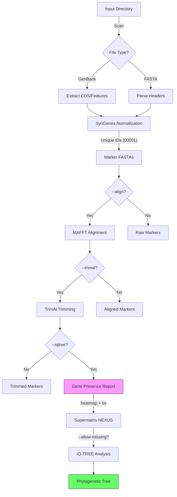

## Citing **SPLACE**
##### [:rocket: Go to Contents Overview](#contents-overview)
When referencing the **SPLACE**, please cite:
```
Oliveira, R. R., Vasconcelos, S., & Oliveira, G. (2022). SPLACE: A tool to automatically SPLit, Align, and ConcatenatE genes for phylogenomic inference of several organisms. Frontiers in Bioinformatics, 2.
https://doi.org/10.3389/fbinf.2022.1074802
```
***  
## Contact
##### [:rocket: Go to Contents Overview](#contents-overview)
For reporting bugs or feedback, please reach out to **Luan Rabelo**: `luan.rabelo@pq.itv.org`
***  